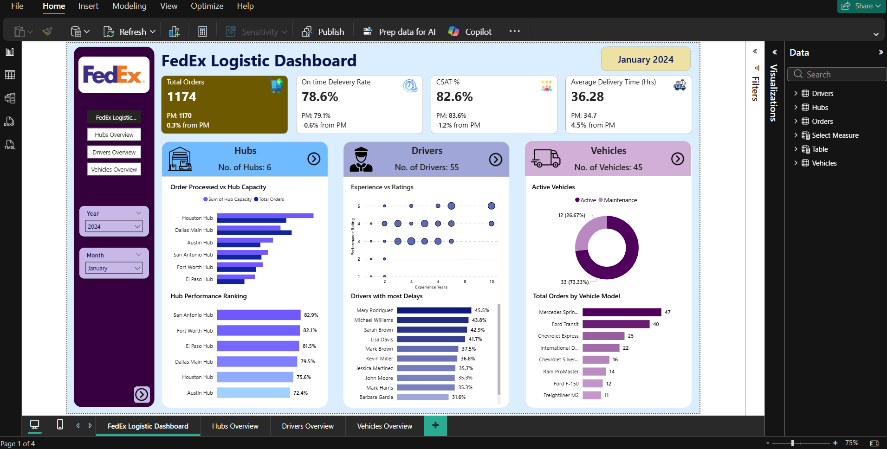
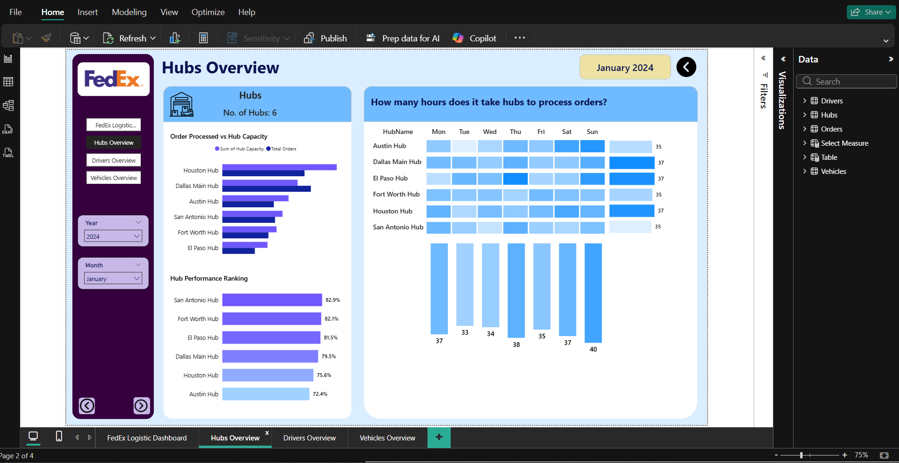
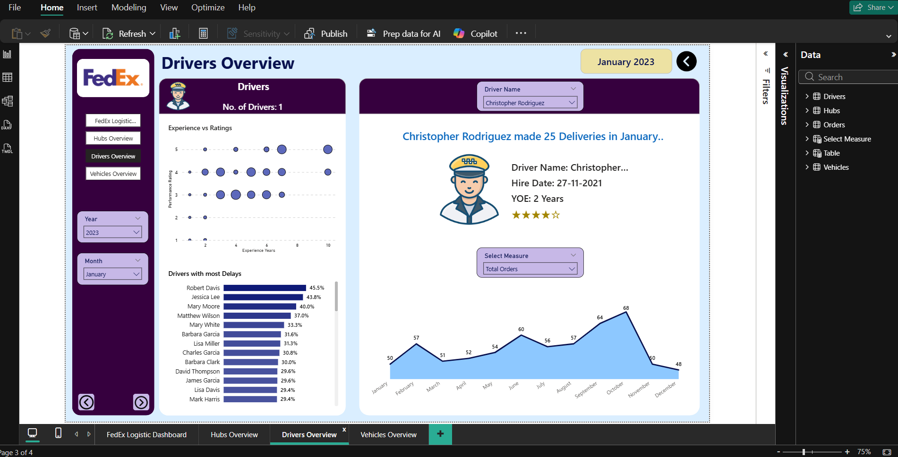
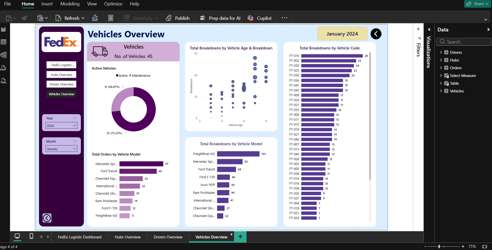

<h1 align="center">📦 FedEx Logistics Dashboard</h1>

A complete end-to-end logistics analytics dashboard built using Power BI to monitor, analyze, and optimize logistics operations.

<h2>🚀 Project Overview</h2>

This project focuses on building a <b>Logistics Dashboard</b> inspired by real-world operations of a company like FedEx. 
The dashboard provides insights into <b>orders, delivery performance, hubs, drivers, and vehicles</b>.

The main goal is to help businesses:

<ul>
<li>Improve delivery efficiency</li>
<li>Monitor operational performance</li>
<li>Reduce delays and breakdowns</li>
<li>Make data-driven decisions</li>
</ul>

<h2>📊 Dashboards Included</h2>

<h3>1️⃣ Overview Dashboard</h3>
<ul>
<li>Total Orders (with MoM change)</li>
<li>On-Time Delivery Rate</li>
<li>Customer Satisfaction (CSAT)</li>
<li>Average Delivery Time</li>
<li>Hubs, Drivers, Vehicles summary</li>
</ul>

<h3>2️⃣ Hubs Overview</h3>
<ul>
<li>Orders vs Hub Capacity</li>
<li>Hub Performance Ranking</li>
<li>Order Processing Time Heatmap</li>
</ul>

<h3>3️⃣ Drivers Overview</h3>
<ul>
<li>Driver Count</li>
<li>Experience vs Rating Analysis</li>
<li>Drivers with Most Delays</li>
<li>Driver Profile Summary</li>
<li>Monthly Order Trends</li>
</ul>

<h3>4️⃣ Vehicles Overview</h3>
<ul>
<li>Total Vehicles</li>
<li>Active vs Maintenance Vehicles</li>
<li>Orders by Vehicle Model</li>
<li>Vehicle Age vs Breakdown Analysis</li>
<li>Breakdowns by Vehicle Code & Model</li>
</ul>

<h2>📈 Key Business Insights</h2>

<ul>
<li>Identify overloaded and underutilized hubs</li>
<li>Track driver performance and delays</li>
<li>Monitor fleet health and breakdown risks</li>
<li>Improve customer satisfaction through timely deliveries</li>
<li>Optimize logistics operations end-to-end</li>
</ul>

<h2>🛠️ Tools & Technologies Used</h2>

<ul>
<li><b>Power BI</b> – Data visualization and dashboard creation</li>
<li><b>DAX</b> – Calculations and KPIs</li>
<li><b>SQL</b> – Data extraction and transformation</li>
<li><b>Python</b> – Data preprocessing and analysis</li>
<li><b>Excel</b> – Data cleaning and preparation</li>
</ul>

<h2>📌 Features</h2>

<ul>
<li>Interactive filters (Year, Month, Driver)</li>
<li>Dynamic KPI tracking with MoM comparison</li>
<li>Advanced visualizations (Heatmaps, Scatter plots, Donut charts)</li>
<li>End-to-end logistics analysis</li>
</ul>

<h2>🔗 Connect With Me</h2>

<h2>💡 Future Improvements</h2>

<ul>
<li>Add forecasting (AI/ML models)</li>
<li>Implement drill-through dashboards</li>
<li>Add real-time data integration</li>
<li>Include cost & profit analysis</li>
</ul>

<h2 align="center">⭐ If you like this project, give it a star!</h2>
